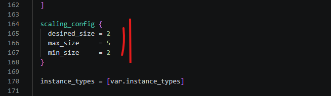
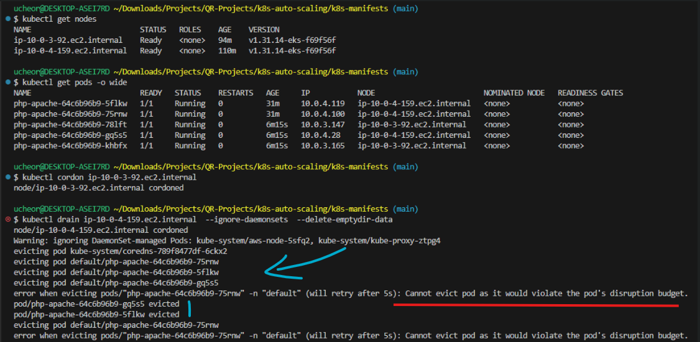

# Kubernetes Auto-Scaling in Practice - A Complete Walkthrough: HPA, PDB, and Cluster Autoscaler

## Introduction

One of the most powerful capabilities of Kubernetes is its ability to automatically scale workloads up and down in response to real demand — and to scale the underlying infrastructure right alongside them. In this article, we walk through a hands-on demo that covers three pillars of Kubernetes auto-scaling:
-	**Horizontal Pod Autoscaler (HPA)** — scales the number of pods based on CPU utilisation
-	**Pod Disruption Budget (PDB)** — enforces availability constraints during voluntary disruptions
-	**Cluster Autoscaler (CA)** — adds or removes EC2 nodes as pod demand changes

Every step below is backed by real terminal output so you can follow along, reproduce it yourself, or simply understand what is happening under the hood.

## Part 1 — Setting Up the Cluster

**Step 1: Provision the EKS Cluster with Terraform**  
We start by provisioning an Amazon EKS cluster using Terraform. The cluster is configured with a Cluster Autoscaler-enabled Auto Scaling Group (ASG) so that Kubernetes can request new EC2 nodes from AWS when pods cannot be scheduled due to insufficient capacity.

**IMPORTANT**: Configure the backend.tf with your S3 bucket name

```
cd terraform-scripts
ls
```


---

To create our cluster, let's start by initializing terraform.

```
terraform init
```


---

Let's go ahead and provision our kubernetes cluster using Terraform.

```
terraform apply # yes to approve
```


---


Once Terraform finishes with cluster provisioning, we update the local kubeconfig and verify that the cluster is healthy:

```
aws eks update-kubeconfig --region us-east-1 --name auto_scaler
kubectl get nodes
kubectl top nodes
```

At this point we should have two worker nodes, both Ready, with low resource utilisation. The cluster is empty and waiting for workloads. 

I have configured the terraform script cluster provisioning to install Metrics Server, making it possible to get resource utilization information. This Metrics Server will also enables the HPA to function by providing CPU utilization information.
 


The Cluster Autoscaler was also installed with Terraform. It watches for pods that cannot be scheduled (Pending state) and asks the ASG to provision new nodes. Without the ASG integration, the Cluster Autoscaler has nowhere to add capacity.

---

**Step 2: Deploy the Application, Service, and HPA**  

Let's navigate into the Kubernetes manifests folder to start our deployments.

```
cd k8s-manifests
```

With the cluster up, we apply three Kubernetes manifests in one go:
-	php-deployment.yaml — a Deployment running the hpa-example image, requesting 480m CPU per pod
-	php-service.yaml — a ClusterIP Service that gives the load generator a stable endpoint
-	php-hpa.yaml — a HorizontalPodAutoscaler targeting 50% average CPU with 2–15 replicas

```
kubectl apply -f php-deployment.yaml
kubectl apply -f php-service.yaml
kubectl apply -f php-hpa.yaml
```


The HPA manifest is worth examining closely. It uses the autoscaling/v2 API and defines separate scale-up and scale-down behaviors:
- minReplicas: 2
- maxReplicas: 15
- averageUtilization: 50   # target CPU %
- scaleUp:   stabilizationWindowSeconds: 15  # react quickly
           value: 3  pods per 15 s, or 50% of current count
- scaleDown: stabilizationWindowSeconds: 30  # be conservative
           value: 25% of pods per 15 s

The asymmetry is deliberate: I have structured the HPA to scale up the replicas fast to avoid user impact, and scale down slowly to avoid thrashing.
 
---

**Step 3: Confirm the HPA Is Active**
After applying the manifests, we confirm the HPA is reporting correctly:
kubectl get all
We can see the HPA object alongside the Deployment and ReplicaSet. The HPA was set up to scale up the replicas if the CPU utilization gets to 50%. CPU is currently 0%/50%, meaning no load yet. The HPA is idle at 2 replicas (its minimum).
 


**Tip:** Running at least 2 pods provides basic redundancy from the start, and prevents the HPA from scaling all the way down to 1 pod during a quiet period.

---

## Part 2 — Generating Load and Watching HPA Scale Up

**Step 4: Deploy the Load Generator**  

To trigger autoscaling we deploy a load-generator: 2 replicas of a BusyBox container, each running 4 parallel wget loops that hammer the php-apache service as fast as possible.

```
kubectl apply -f load-generator.yaml
```

The load generator application creates 4 worker processes per pod × 2 pods = 8 concurrent HTTP request streams hitting the service continuously. This is enough to push CPU well past the 50% threshold almost immediately. The plan is to emulate increased load on our application, leading to higher CPU utilization. Once the CPU utilization goes reaches 50%, the HPA should become active and start scaling the pods to accomodate the increased load. 


Once our current nodes get to maximum capacity, they will be unable to accomodate more pods. The waiting pods remain in pending state because there is no space in the cluster to accomodate them. This is where the Cluster Autoscaler comes in. Once the autoscaler notices, the pending pods, it triggers the creation of additional nodes in AWS so that the Pending pods can finally be scheduled in the new cluster nodes. 

**Note:** The Cluster Autoscaler will still respect the min and max node specifications for your node group. 



---
  
**Step 5: HPA Detects Overload and Starts Scaling**  

Within seconds of deployoing the load-generator deployment, the HPA metrics server picks up the spike. Because our scaleUp window is only 15 seconds and the policy allows up to 3 new pods every 15 seconds (or 50% of current count, whichever is greater), the HPA reacts quickly.
We can watch the pods in real time:

```
kubectl get pods -l run=php-apache -w
```

The pods are transitioning from Pending → ContainerCreating → Running in rapidly moving the replica count up to 15. 
 


---

**Step 6: Cluster Autoscaler Provisions New Nodes**  

The two original nodes we set up only have 2 CPU cores each. With 480m requested per pod, they can host roughly 4 pods each. As the HPA tries to schedule 10–15 pods, many of them land in Pending state because there is no room. This is the signal the Cluster Autoscaler waits for: it detects unschedulable pods and instructs the ASG to launch new EC2 instances. The new nodes join the cluster and go from **Not Ready** to **Ready** to accept new pods.
 


```
kubectl get nodes -w
```

We can confirm that new nodes are joining the cluster so they can accomodate the previously pending pods. Note the age of the new nodes.


**How the Cluster Autoscaler decides:**   

In our configuration *php-hpa.yaml*, it checks every 10 seconds. If it sees pods that have been Pending for over 3 minutes due to insufficient resources, it calculates how many new nodes are needed and triggers an ASG scale-out. It will not add more nodes than the ASG maximum stated on the node group configuration.

---

## Part 3 — Removing Load and Watching Scale Down  

**Step 7: Delete the Load Generator - Scaling Down**

Now that we have demonstrated scale-up using HPA, let's remove the load generator deployment to let the system scale back down:

```
kubectl delete -f load-generator.yaml
```


---

**Step 8: HPA Begins Scaling Down**  

Without the load generator, the CPU drops to 0%. As previously configured, the HPA does not scale down instantly — it waits for the scaleDown stabilizationWindowSeconds (30 s) and then removes at most 25% of pods every 15 seconds. This prevents flapping if load spikes again briefly.
Let's watch both pods and HPA simultaneously. The HPA progressively reducing replica count from 15 back toward the minimum, 2.

```
kubectl get pods -l run=php-apache -w
kubectl get hpa -w
```


 
---

**Step 9: Cluster Autoscaler Scales Down Nodes**  

Once the pod count drops, nodes have spare capacity. After a cool-down period (default 10 minutes of underutilisation), the Cluster Autoscaler cordons and drains excess nodes (NotReady, SchedulingDisabled) and terminates the underlying AWS EC2 instances. The cluster returns to fewer nodes in the absence of the extra load.


 
We should be back to minimum nodes count and minimum pods count since the load has been removed.


---

## Part 4 — Manual Scaling and the HPA Relationship  

**Step 10: Manually Scale the Deployment to Test HPA**  

**One common question is:** what happens if you manually scale a deployment that is managed by an HPA? The answer is instructive.
If you scale up beyond the HPA maximum, the HPA will eventually pull it back down. If you scale below the HPA minimum, the HPA will scale it back up. Only within the min/max window does the HPA let your manual change persist — and even then it will adjust it at the next evaluation based on metrics. 

To test this out, while keeping out min and max for our HPA at 2 and 15 respectively, let's try to scale up when there is no extra node and then, try to scale down below the minimum.

```
kubectl scale deployment php-apache --replicas=3
kubectl get pods -w
```
In trying to scale the replica count to 3, the HPA will calculate to see if there is a need for the 3 pods. Once it realizes the CPU utilization does not warrant 3 pods, it will quickly scale back down to 2 pods and remove the excess pod.
 


---

On the other hand, when we try to scale down to 1 replica, the HPA prevents this from happening since the minimum specified is 2 pods. It does not allow for less than 2 pods to exist in the cluster.

```
kubectl scale deployment php-apache --replicas=1
kubectl get pods -w
```
 


**Key takeaway:** The HPA owns the replica count. If you manually set replicas below the minimum, the HPA corrects it within the next reconciliation loop (typically within 15–30 seconds). Manual scaling is useful for one-off adjustments but the HPA always has the final say. Thus, while 

---

## Part 5 — Introducing the Pod Disruption Budget

**What is a PodDisruptionBudget?**  

A PodDisruptionBudget (PDB) limits how many pods from a given selector can be voluntarily disrupted at the same time. "Voluntary" means actions like kubectl drain (node maintenance), a rolling deployment update, or the Cluster Autoscaler evicting pods to reclaim a node.

Without a PDB, draining a node could kill all your pods simultaneously if they happened to all be running on that node. With a PDB, Kubernetes will refuse an eviction that would violate the budget and retry later.

---

**Step 11: Remove HPA, Apply PDB, and Test Pod Disruption Budget**  

For this part of the demo, we first delete the HPA (so it does not interfere with our manual replica count) and then create a PDB:

```
kubectl delete -f php-hpa.yaml
kubectl apply -f php-pdb.yaml
kubectl get pdb
```

Note the PDB configuration in *php-pdb.yaml*:

```
spec:
  minAvailable: 3
  selector:
    matchLabels:
      run: php-apache
```

This says: at no point during a voluntary disruption may fewer than 3 php-apache pods be available. Since we have 5 pods running and minAvailable is 3, at most 2 can be disrupted simultaneously.
 


We can now go ahead and scale the deployment up to 5 replicas.

```
kubectl scale deployment php-apache --replicas=5
```


 
We should now have all our 5 pods running, distributed across the two available nodes. Note the names of the nodes. We will need it in a later stage.

---

**Step 12: Drain a Node and Watch the PDB Enforce Its Budget**  

Now we trigger a voluntary disruption. We cordon one node (preventing new pods from being scheduled on it) and then drain the other node — which evicts all pods on that node and reschedules them elsewhere. 

```
kubectl get nodes
```

Note the name of both nodes. In our case we have 3 pods on *ip-10-0-4-159.ec2.internal* and 2 pods on *ip-10-0-3-92.ec2.internal*

---

Let's cordon off the node with 2 pods so it is unable to accept more pods and try to drain the node with 3 pods. Our expectation is that since the pod disruption budget is 3, evicting all the 3 pods will casue an issue since that will only leave 2 pods running.

```
kubectl cordon *ip-10-0-3-92.ec2.internal*  # update with your node name
```

---

```
kubectl drain *ip-10-0-4-159.ec2.internal* --ignore-daemonsets --delete-emptydir-data   # update with your node name
```

 


The kubectl drain process could not be completed - the PDB blocks eviction of 75rnw pod with the message "Cannot evict pod as it would violate the pod's disruption budget" and retries after 5s

This is the PDB doing its job. The drain tries to evict all pods on that node at once, but the PDB enforces that 3 must always be available. So evictions happen one at a time, waiting for each evicted pod to be rescheduled and reach Running before allowing the next eviction.


**What you would see without a PDB:**  
Without a PDB, all pods on the drained node would be terminated simultaneously. If the application has any in-flight requests or a cold-start delay, this can cause a noticeable outage. The PDB gives Kubernetes the information it needs to perform a rolling eviction instead.

---

**Step 13: Cluster Autoscaler Kicks In During Drain**  

As pods get evicted from the drained node, they must be rescheduled. But we also cordoned the other original node, so there is no room on the remaining nodes. The Cluster Autoscaler detects the Pending pods and provisions a new node. The new nodes join the cluster to absorb the pods displaced by the drain. 
 


---

**Step 14: Extra Nodes Scale Down After Drain Completes** 

Once the drain is finished and all pods are Running on healthy nodes, the drained node will have no pods. The Cluster Autoscaler marks all provisioned idle nodes for termination and removes them after the cooldown. We can view them moving through SchedulingDisabled → NotReady → Gone.

```
kubectl get nodes -w
```


 
---

**Step 15: System Stabilises **  

After uncordoning the surviving nodes and allowing the Cluster Autoscaler to reclaim the extras nodes, the cluster settles back to a healthy state with all pods distributed across available nodes. 
 


Cluster is stable with 5 pods running on 2 nodes after the drain cycle completes. The Pod Disruption Budget ensured that there were a minimum of 3 pods in the cluster during voluntary pod deletion.

---

## Part 6 — Clean Up

With the demo complete, we can go ahead and clean up all resources to avoid incurring AWS charges:

```
kubectl delete deployment.apps/php-apache
kubectl delete pdb php-apache-pdb
```

```
cd ../terraform-scripts && terraform destroy
```


Use terraform destroy to tear down the EKS cluster and all associated AWS resources.

## Summary: Three Layers of Kubernetes Auto-Scaling

This walkthrough demonstrated how three Kubernetes features work together to create a self-healing, cost-efficient cluster:

**Horizontal Pod Autoscaler (HPA)**  
-	Watches CPU (or custom metrics) against a target utilisation
-	Scales pods up quickly and down conservatively using configurable behaviors
-	Always maintains between minReplicas and maxReplicas
**Pod Disruption Budget (PDB)**   
-	Prevents voluntary disruptions from violating your availability requirements
-	Forces rolling evictions instead of mass terminations during node drain or maintenance
-	Works with the Cluster Autoscaler to protect workloads during scale-down
**Cluster Autoscaler (CA)**  
-	Adds nodes when pods are Pending due to insufficient capacity
-	Removes underutilised nodes after a cooldown period
-	Respects PDBs and pod anti-affinity rules before draining a node

Used together, these three mechanisms mean your application can handle sudden traffic spikes without manual intervention, and your infrastructure costs track actual usage rather than worst-case provisioning.


#Kubernetes #AWS #Terraform #InfrastructureAsCode #DevOps #EKS #Microservices #AutoScaling

---

*If this guide was of interest, feel free to connect or share. What has been your experience setting up auto-scaling for your resources, what issues do you run into and how do you resolve them?*
